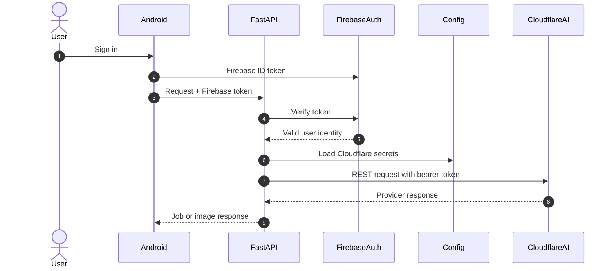
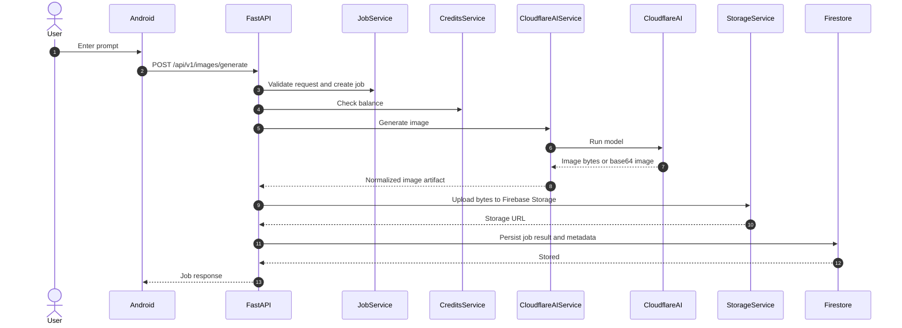
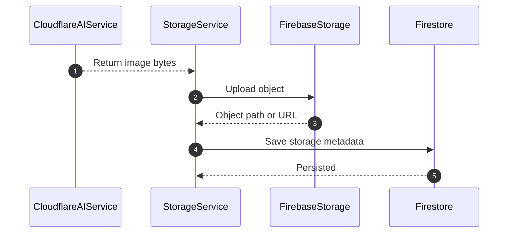
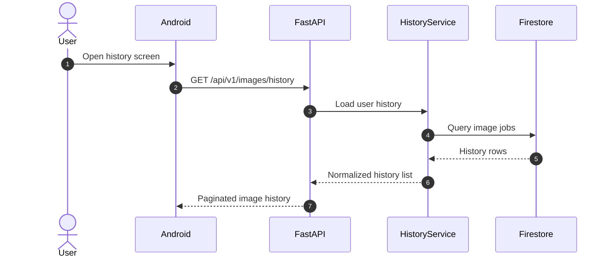
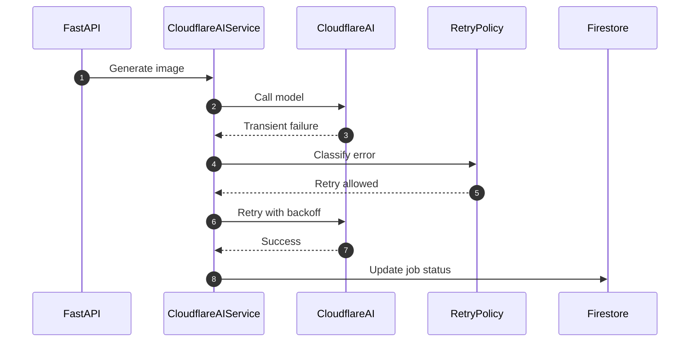

# Lumora AI Backend Architecture for Cloudflare Workers AI

## Purpose

This document redesigns the Lumora AI backend so Cloudflare Workers AI becomes the inference layer for image generation while preserving a provider-agnostic backend boundary.

The goal is to keep FastAPI as the application gateway, Firestore as the source of truth for jobs and metadata, Firebase Storage as the image store, and Firebase Authentication as the user identity layer.

No production code is introduced here. This is an architecture and implementation plan only.

---

## 1. Cloudflare Workers AI Documentation Summary

### Authentication

Cloudflare Workers AI is accessed in two different ways:

- REST API from external services, which requires a Cloudflare API token and Account ID.
- Workers binding inside Cloudflare Workers, which uses `env.AI.run(...)` and does not require embedding the token in code.

For Lumora AI, the FastAPI backend should call the REST API directly because FastAPI is not running inside a Cloudflare Worker.

Required REST headers:

- `Authorization: Bearer <CLOUDFLARE_API_TOKEN>`
- `Content-Type: application/json` for JSON requests
- `Content-Type: multipart/form-data` for models that require multipart input

The API token should be scoped only to the minimum Workers AI permissions needed, typically read and generate access.

### API Flow

The canonical REST endpoint is:

```http
POST /client/v4/accounts/{account_id}/ai/run/{model_name}
```

The flow is:

1. Choose a model name.
2. Build the model-specific request body.
3. Send the request with the bearer token.
4. Parse the Cloudflare wrapper response.
5. Extract the model result from the `result` field.

Cloudflare also supports a Workers binding flow:

1. Configure a binding named `AI`.
2. Call `env.AI.run(model, input)` from a Worker.
3. Return the model result or SSE stream.

For Lumora AI, the backend should use the REST path first, while keeping the provider interface compatible with a future Worker-based implementation.

### Request Format

Workers AI request format is model-specific.

Common patterns observed in the docs:

- JSON request bodies for text generation and simpler inference tasks.
- Multipart form requests for some image models, especially image-generation or image-editing models that accept width, height, steps, prompt, or reference images.
- Model schemas are documented per model and should be treated as the authoritative contract.

Relevant fields for image generation models include:

- `prompt`
- `negative_prompt`
- `width`
- `height`
- `steps`
- `seed`
- `guidance`
- `strength`
- `image` or `image_b64` for image-conditioned workflows
- multipart payloads for models that expect binary or form-encoded input

### Response Format

The REST API wraps responses in a standard Cloudflare envelope:

- `success`
- `errors`
- `messages`
- `result`

The actual AI output is returned in `result` and varies by model type.

For image models, the output commonly includes:

- a base64-encoded image string
- or a model-specific object that contains the generated image in a field such as `image`

The backend should normalize the provider response into an internal image artifact object before storing anything.

Recommended backend normalization:

- decode base64 to bytes
- determine MIME type
- upload bytes to Firebase Storage
- persist the resulting storage URL and metadata in Firestore

### Image Models

Cloudflare Workers AI includes multiple image-oriented models. The most relevant families for Lumora AI are the Black Forest Labs models:

- `@cf/black-forest-labs/flux-1-schnell`
- `@cf/black-forest-labs/flux-2-dev`
- `@cf/black-forest-labs/flux-2-klein-4b`
- `@cf/black-forest-labs/flux-2-klein-9b`

Architecture notes:

- `flux-1-schnell` is a text-to-image model with prompt and seed style inputs.
- `flux-2-dev` and `flux-2-klein-*` support image generation and editing-oriented workflows.
- The `flux-2-klein-*` models use multipart style inputs in the docs and are appropriate when the backend must pass structured image parameters.

Recommended default choice for an initial Lumora image pipeline:

- `flux-1-schnell` for fast, lower-cost generation
- `flux-2-klein-9b` for higher-quality interactive workflows when latency and editing capability matter

### Rate Limits

Workers AI rate limits are organized by task type and, in some cases, by model.

Relevant defaults from the docs:

- Text-to-Image: 720 requests per minute
- Text Generation: 300 requests per minute
- Image Classification: 3000 requests per minute
- Image-to-Text: 720 requests per minute
- Object Detection: 3000 requests per minute

The docs also note that some models have higher or lower model-specific limits.

Architecture implication:

- The backend should implement its own user-level quotas and throttling before hitting Cloudflare limits.
- The backend should assume model-specific limits can change and should not hardcode them as the only protection.

### Pricing

Workers AI pricing is neuron-based.

Current documentation highlights:

- 10,000 neurons per day are included at no charge on free allocation.
- Paid usage is billed at $0.011 per 1,000 neurons.
- Image models are billed with model-specific unit pricing, often based on tile size, megapixels, or steps.

Examples from the docs:

- `flux-1-schnell` uses a per-tile and per-step model.
- `flux-2-dev` uses per input and output tile pricing per step.
- `flux-2-klein-9b` uses per input megapixel and subsequent output megapixel pricing.

Architecture implication:

- The backend should estimate neuron cost before dispatch.
- The backend should persist actual cost metadata after each generation.
- The credits system should not rely on raw Cloudflare prices in the Android client.

### Streaming Support

Workers AI supports streaming for compatible models using SSE when `stream: true` is supplied.

Important details:

- Streaming is primarily useful for text generation and agentic workloads.
- The response can be streamed incrementally rather than waiting for a final object.
- Image generation is typically handled as a non-streaming binary artifact flow.

Architecture implication:

- The provider interface should support streaming for future text workloads.
- The image pipeline should remain non-streaming by default.

### Best Practices

Recommended practices from the docs and from the backend design:

- Keep static prompt content first when using prompt caching.
- Reuse tool definitions and stable context when prompts are repeated.
- Use `x-session-affinity` for workloads that benefit from prefix caching.
- Monitor cached tokens if prompt caching is used.
- Use model-specific schemas instead of assuming a single universal payload.
- Keep customer content handling explicit and minimal.
- Use AI Gateway later if centralized retry, caching, and observability become necessary.

### Error Handling

Relevant Workers AI errors include:

- `400` invalid or incomplete request
- `400` no such model
- `403` account blocked or not allowed for private model
- `404` invalid model ID
- `405` deprecated SDK or unsupported LoRa path
- `408` timeout or aborted request
- `413` request too large
- `429` account limited or out of capacity

Recommended backend behavior:

- Do not retry validation errors.
- Retry transient failures with exponential backoff and a cap.
- Surface provider-specific errors as normalized application errors.
- Preserve provider error metadata in job records for debugging.

### Security

Cloudflare states that customer content is not used to train Workers AI models without explicit consent.

For Lumora AI, the security posture should be:

- Never expose the Cloudflare API token to Android.
- Keep all AI calls server-side in FastAPI.
- Validate Firebase Auth tokens at the backend boundary.
- Enforce prompt length, file type, and content validation before calling the provider.
- Do not log raw prompts or image payloads in plain text logs.
- Store images in Firebase Storage and only persist public or signed URLs as needed.
- Use least-privilege Cloudflare tokens.
- Encrypt secrets at rest in environment/config management.

---

## 2. Redesigned Backend Architecture

### Current Architecture

```text
Android
  -> FastAPI
  -> AI Provider
  -> Firebase Storage
  -> Firestore
  -> Android
```

### Target Architecture

```text
Android
  -> FastAPI
  -> Application Services
  -> AIProvider Interface
  -> CloudflareProvider
  -> Cloudflare Workers AI REST API
  -> Firebase Storage
  -> Firestore
  -> Android
```

### Architectural Principles

- Routers are thin and only translate HTTP to service calls.
- Services own business rules and orchestration.
- Provider adapters own external AI API details.
- Storage adapters own Firebase Storage and Firestore persistence.
- Future providers should be swappable without router changes.

---

## 3. Backend Folder Structure

This is the target structure for the backend layer.

```text
backend/
  app/
    main.py
    core/
      config.py
      firebase.py
      security.py
      logging.py
    config/
      providers.py
      models.py
      limits.py
    routers/
      auth.py
      images.py
      history.py
      jobs.py
      credits.py
      health.py
    schemas/
      auth.py
      images.py
      jobs.py
      history.py
      credits.py
      common.py
      errors.py
    services/
      cloudflare_ai_service.py
      ai_provider.py
      image_service.py
      job_service.py
      history_service.py
      credits_service.py
      storage_service.py
      firestore_service.py
      auth_service.py
    providers/
      cloudflare_provider.py
      replicate_provider.py
      vertex_provider.py
      openai_images_provider.py
    workers/
      job_worker.py
      retry_worker.py
    database/
      repositories/
      firestore_repositories/
    middleware/
      auth.py
      error_handler.py
      request_id.py
      rate_limit.py
    utils/
      validation.py
      serialization.py
      model_selection.py
      retry.py
      cost.py
    models/
      job.py
      image.py
      user.py
      credit_ledger.py
      provider_result.py
  tests/
    unit/
    integration/
    contract/
```

Notes:

- The existing `routers`, `services`, `schemas`, `core`, `database`, `middleware`, `utils`, and `workers` layout can be evolved into this shape.
- The new `providers` package is the key abstraction layer for future AI provider swaps.
- The `config` package separates runtime AI configuration from general app configuration.

---

## 4. Service Architecture

### AIProvider Interface

The provider interface should be the only contract that application services depend on for inference.

Responsibilities:

- authenticate to the vendor
- select or validate the model
- execute image generation
- normalize provider errors
- support retries for transient failures
- return image bytes plus metadata
- estimate neuron or token cost

Conceptual interface:

```text
AIProvider
  -> generate_image(request)
  -> estimate_cost(request)
  -> select_model(request)
  -> map_error(provider_error)
  -> supports_streaming()
```

### Provider Implementations

- `CloudflareProvider` for Workers AI
- `ReplicateProvider` for later migration
- `VertexProvider` for Google Vertex AI
- `OpenAIImagesProvider` for OpenAI Images

Only the provider implementation should change when switching vendors.

### CloudflareAIService

This is the application-facing service that uses the provider interface.

Responsibilities:

- authenticate with Cloudflare through server-side secrets
- generate image requests
- handle errors and normalize them
- retry transient provider failures
- return image bytes and metadata
- estimate credits before dispatch
- select the correct model based on product rules

Rules:

- No business logic in routers.
- No Cloudflare-specific request construction outside this service or its provider adapter.
- No Firestore or Firebase Storage calls inside the provider adapter.

### Supporting Services

- `JobService` creates and updates generation jobs.
- `CreditsService` validates balance and performs ledger updates.
- `StorageService` uploads image bytes to Firebase Storage.
- `FirestoreService` persists job, history, and share metadata.
- `HistoryService` reads and filters generation history for the client.
- `AuthService` validates Firebase Authentication identity and maps it to application users.

---

## 5. API Design

All endpoints are mounted under `/api/v1`.

### POST /api/v1/images/generate

Purpose:

- submit a prompt for image generation
- create a job record
- validate credits
- start provider execution

Request body should include:

- prompt
- optional negative prompt
- optional width and height
- optional aspect ratio
- optional model override
- optional seed
- optional style or preset
- optional reference image metadata if supported later

Response should return:

- job id
- status
- model
- estimated credits or neurons
- queue state
- created time

### GET /api/v1/images/{id}

Purpose:

- fetch a single image job by id
- return generation status
- return provider metadata
- return storage URL when complete

Response should include:

- job metadata
- prompt
- model
- status
- progress
- storage URL
- error summary if failed

### GET /api/v1/images/history

Purpose:

- return the authenticated user’s image history
- support pagination and filters
- power the Android gallery and recents views

Response should include:

- list of image jobs
- pagination cursor or page number
- summary fields such as title, thumbnail, status, created time, and model

### POST /api/v1/images/regenerate

Purpose:

- clone an existing generation job
- reuse prompt and model metadata
- allow optional prompt edits or parameter overrides
- create a new job and new storage artifact

Response should include:

- new job id
- copied source id
- queue state
- estimated cost

### DELETE /api/v1/images/{id}

Purpose:

- delete the image job metadata
- optionally delete the image object from Firebase Storage
- remove the item from the user’s visible history when supported by product rules

Response should include:

- deleted status
- deleted resource ids
- storage deletion result

### POST /api/v1/images/share

Purpose:

- create a share token or public share object
- optionally generate a signed URL
- support social sharing from Android

Response should include:

- share id
- share URL
- expiration metadata if applicable
- visibility state

### Router Design Rule

Each router should only:

- parse input
- validate request shape
- call a service
- return a typed response

Routers must not:

- call Cloudflare directly
- create storage objects directly
- perform prompt or cost policy logic
- talk to Firestore ad hoc

---

## 6. Request and Response Models

### Image Generate Request

Suggested fields:

- `prompt: string`
- `negative_prompt: string | null`
- `model: string | null`
- `width: int | null`
- `height: int | null`
- `aspect_ratio: string | null`
- `seed: int | null`
- `steps: int | null`
- `style: string | null`
- `reference_image_url: string | null`
- `idempotency_key: string | null`

### Image Job Response

Suggested fields:

- `id: string`
- `status: queued | running | succeeded | failed | canceled`
- `model: string`
- `estimated_cost_neurons: int | null`
- `queue_position: int | null`
- `progress: int`
- `created_at: datetime`
- `updated_at: datetime`

### Image Detail Response

Suggested fields:

- `id`
- `prompt`
- `model`
- `status`
- `progress`
- `image_url`
- `thumbnail_url`
- `storage_path`
- `provider_request_id`
- `provider_cost`
- `error_code`
- `error_message`

### History Item Response

Suggested fields:

- `id`
- `title`
- `prompt_preview`
- `model`
- `status`
- `image_url`
- `thumbnail_url`
- `created_at`

### Regenerate Request

Suggested fields:

- `source_image_id: string`
- `prompt_override: string | null`
- `model_override: string | null`
- `seed_override: int | null`
- `style_override: string | null`

### Share Response

Suggested fields:

- `share_id: string`
- `share_url: string`
- `expires_at: datetime | null`
- `visibility: public | unlisted | private`

---

## 7. Queue Flow

### End-to-End Flow

```text
User
  -> Android
  -> FastAPI
  -> Validate Prompt
  -> Check Credits
  -> Create Job
  -> Cloudflare Workers AI
  -> Receive Image
  -> Upload Image to Firebase Storage
  -> Store URL in Firestore
  -> Return Job
  -> Android
```

### Flow Design Notes

- The API should create a Firestore job first so the request is durable.
- The provider call should happen in a service or worker stage, not in the router.
- The storage write should happen after the image bytes are normalized.
- The Firestore record should be updated atomically with the final status and URL.

### Retry Strategy

Retry only transient failures:

- timeouts
- aborted requests
- out-of-capacity responses
- selected 429s with backoff
- selected 5xx provider failures

Do not retry:

- invalid prompt validation errors
- invalid model names
- model agreement errors
- request too large errors
- unsupported model capability mismatches

---

## 8. Mermaid Diagrams

### Authentication



### Generation Flow



### Storage Flow



### History Flow



### Retry Flow



---

## 9. Environment Configuration

### Cloudflare Variables

- `CLOUDFLARE_API_TOKEN`
  - Used by `CloudflareProvider` or `CloudflareAIService` to authenticate REST requests.
  - Must never be exposed to Android or committed to source control.

- `CLOUDFLARE_ACCOUNT_ID`
  - Used to build the Workers AI REST endpoint path.
  - Required for every request to `POST /accounts/{account_id}/ai/run/{model_name}`.

- `WORKERS_AI_MODEL`
  - Default model name for image generation.
  - Used by model selection logic when the client does not specify a model.

- `WORKERS_AI_TIMEOUT_SECONDS`
  - Maximum time allowed for a provider call before the backend aborts or retries.
  - Used by the provider client and retry policy.

- `WORKERS_AI_MAX_RETRIES`
  - Number of retry attempts allowed for transient provider errors.
  - Used by the retry policy.

- `WORKERS_AI_RETRY_BACKOFF_SECONDS`
  - Base backoff window for exponential retry logic.
  - Used by the retry policy.

- `WORKERS_AI_SESSION_AFFINITY_ENABLED`
  - Optional toggle for future text or agent workloads that benefit from prefix caching.
  - Mostly relevant if the backend later supports streamed text generation.

### Firebase Variables

- `FIREBASE_PROJECT_ID`
  - Identifies the Firebase project used by Auth, Firestore, and Storage.
  - Used by Firebase initialization and Firestore lookups.

- `FIREBASE_STORAGE_BUCKET`
  - Used by the Firebase Storage client to upload generated images.
  - Required for image persistence.

- `FIREBASE_CREDENTIALS_PATH`
  - Path to the service account JSON for local or server-side Firebase admin initialization.
  - Used only in the backend environment.

### Application Variables

- `API_PREFIX`
  - Base prefix for all backend routes.
  - Default should remain `/api/v1`.

- `ALLOWED_ORIGINS`
  - CORS allowlist for Android local development and production app hosts.
  - Used by FastAPI CORS middleware.

- `JWT_SECRET`
  - Used if the backend issues any internal session or service tokens.
  - If Firebase Auth is the only identity system, this may be unused or reserved for future use.

- `APP_ENV`
  - Controls debug features such as docs exposure and logging verbosity.

- `LOG_LEVEL`
  - Controls server logging detail.

### Where These Variables Live

- Local development: `.env`
- Production: deployment secret manager or platform environment variables
- Never in Android app assets

---

## 10. Future Scalability

The architecture must allow the AI provider to be replaced without router changes.

### Interface-Based Design

```text
AIProvider
  -> CloudflareProvider
  -> ReplicateProvider
  -> VertexProvider
  -> OpenAIImagesProvider
```

### Swap Rules

Only provider implementations change when switching vendors.

Unchanged layers:

- routers
- request validation
- Firestore persistence
- Firebase Storage upload flow
- credits accounting
- history endpoints

### Provider Capability Matrix

The provider interface should describe capabilities such as:

- image generation
- image editing
- streaming text generation
- cost estimation
- model listing
- retryable failure mapping

This allows one backend contract to support multiple vendors.

---

## 11. Implementation Roadmap

### Phase 1 - Architecture Lock

- Finalize provider abstraction.
- Finalize request and response models.
- Finalize job lifecycle states.
- Finalize error taxonomy.

### Phase 2 - Core Backend Refactor

- Introduce `AIProvider` interface.
- Add `CloudflareProvider` implementation.
- Add `CloudflareAIService` orchestration.
- Split storage and Firestore responsibilities into dedicated services.

### Phase 3 - Image Pipeline

- Implement prompt validation.
- Implement credit checks.
- Implement Firestore job creation.
- Implement Firebase Storage upload.
- Implement image history persistence.

### Phase 4 - Client-Facing APIs

- Build the image generation router.
- Build history, detail, regenerate, delete, and share endpoints.
- Normalize all responses for Android consumption.

### Phase 5 - Reliability and Observability

- Add retries and backoff.
- Add idempotency.
- Add request IDs and structured logging.
- Add provider cost and latency metrics.

### Phase 6 - Provider Portability

- Add Replicate provider.
- Add Vertex provider.
- Add OpenAI Images provider.
- Introduce provider selection rules.

---

## 12. Development Phases

### MVP

- Single provider: Cloudflare Workers AI
- Single primary image model
- Basic job persistence
- Firebase Storage upload
- Firestore history list
- Android polling for status

### Production Ready

- Retry policy
- Proper error taxonomy
- Credits enforcement
- Share links
- Soft deletion
- Monitoring and audit trail

### Multi-Provider

- Provider interface fully stabilized
- Model selection by capability and cost
- Fallback providers for failure resilience
- Router contract unchanged

---

## 13. Best Practices

- Keep routers thin.
- Keep provider code isolated.
- Validate prompt length and file type before provider dispatch.
- Use typed request and response models.
- Persist job state transitions.
- Store generated bytes in Firebase Storage, not in Firestore.
- Return URLs and metadata to Android, not raw provider payloads.
- Normalize provider errors into app-level errors.
- Estimate cost before generation and record actual cost after generation.
- Use exponential backoff with retry ceilings.
- Log correlation IDs for every generation request.
- Keep secrets server-side only.
- Maintain provider portability from day one.

---

## 14. Summary

Cloudflare Workers AI should be treated as a provider implementation behind an application-level AI interface, not as a direct router dependency.

This keeps Lumora AI flexible: FastAPI stays stable, Firestore remains the job and history source of truth, Firebase Storage stores generated images, Android consumes a consistent API, and Cloudflare can later be replaced by another provider without changing the router contract.
